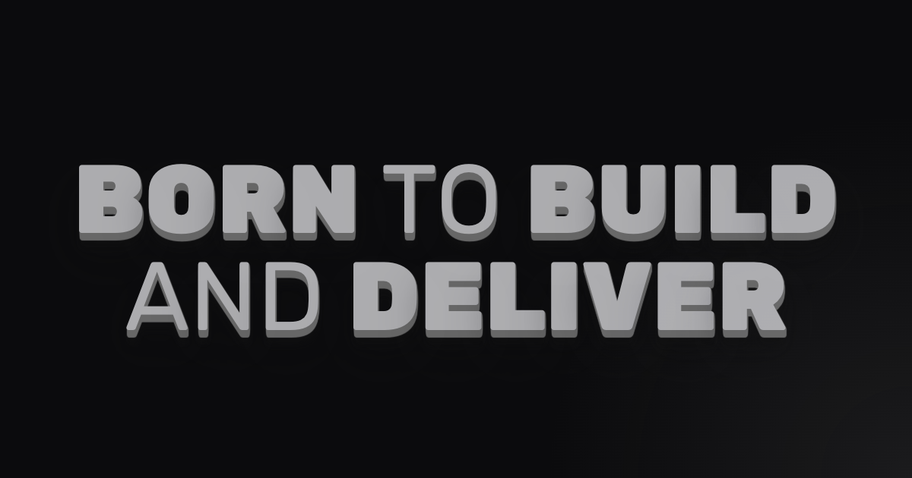

<h1 align="center">robsonjunior.dev</h1>

    

- https://www.robsonjunior.dev/ - Primary
- https://www.rjr.dev/ - 
- https://www.robsongajunior.dev/

## Commands

All commands are run from the root of the project, from a terminal:

| Command                   | Action                                           |
| :------------------------ | :----------------------------------------------- |
| `npm install`             | Installs dependencies                            |
| `npm run dev`             | Starts local dev server at `localhost:3000`      |
| `npm run build`           | Build your production site to `./dist/`          |
| `npm run preview`         | Preview your build locally, before deploying     |
| `npm run astro ...`       | Run CLI commands like `astro add`, `astro check` |
| `npm run astro -- --help` | Get help using the Astro CLI                     |

## IMPORTANT LINKS

- [Icons](https://www.svgrepo.com/)
- [Contrast Checker](https://coolors.co/contrast-checker/)
- [Screen Resolution Stats](https://gs.statcounter.com/screen-resolution-stats)
